# cloud-run-pipeline-demo

This purpose of this project is to demonstrate an example CI/CD pipeline using GitHub actions.

<details style="background-color: #303030">
<summary><span style="font-size: 1.8em; font-weight: bold">0️⃣ About the Application</span></summary>

### Build and Test

The application itself is built with Spring Boot 3, Java 17, and can be compiled, tested and started
locally with the included Gradle wrapper:

  ```
  ./gradlew build test
  java -jar build/libs/demo-0.0.3-SNAPSHOT.jar # or whatever version we're at
  ```

Alternatively, you can build and run it in a container:

  ```
  docker build -t demo .
  docker run --rm -p 8080:8080 demo
  # make sure it's alive
  curl localhost:8080
  ```

Once running, you will find ways to interact with the application at http://localhost:8081/.

</details>

----

<details style="background-color: #303030">
<summary><span style="font-size: 1.8em; font-weight: bold">1️⃣ First Exercise</span></summary>

### Create a Fork

Start by creating a fork of this repository under your own GitHub account. From there you can
experiment freely - even deploy it to our cloud (once we give you the necessary credentials)!

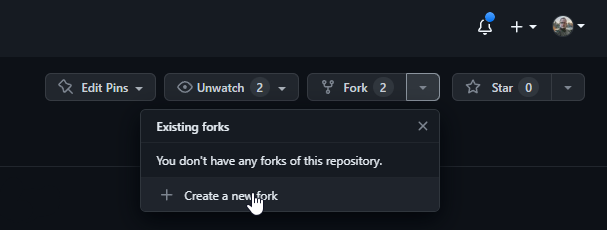

----

Select your own GitHub account as the "Owner", and click the "Create fork" button.

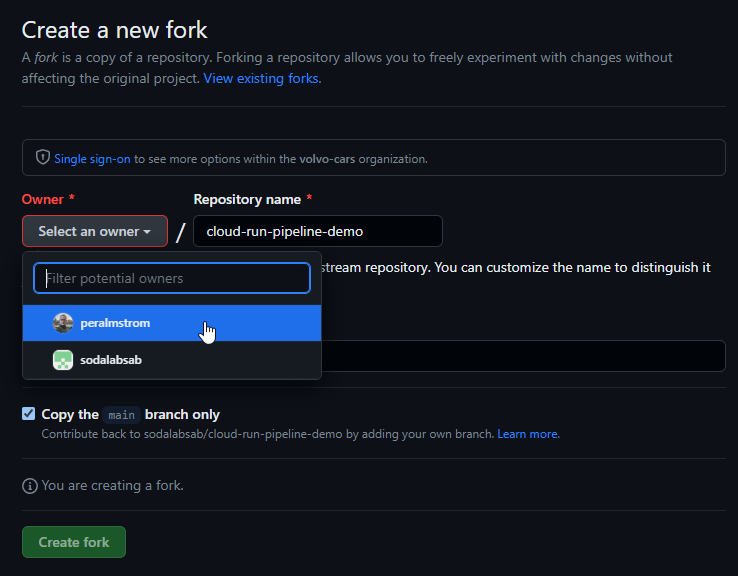

### Add GCP Credentials

In order to push and subsequently deploy the containerized service, we need to add the appropriate
Google Cloud credentials. Start by going into the project settings:

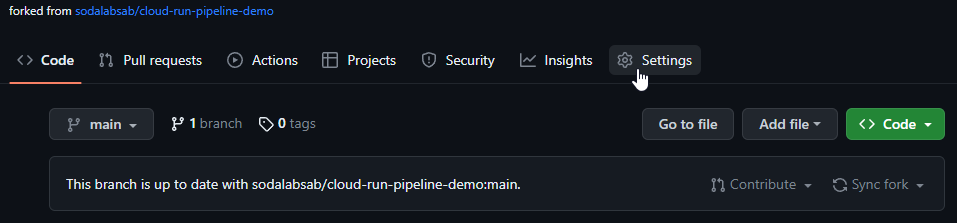

----

In the left-hand menu, under "Security", find "Secrets and variables". Click it, and then "Actions"
below:

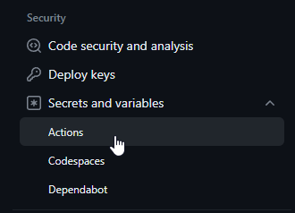

----

Here, add a "New repository secret":

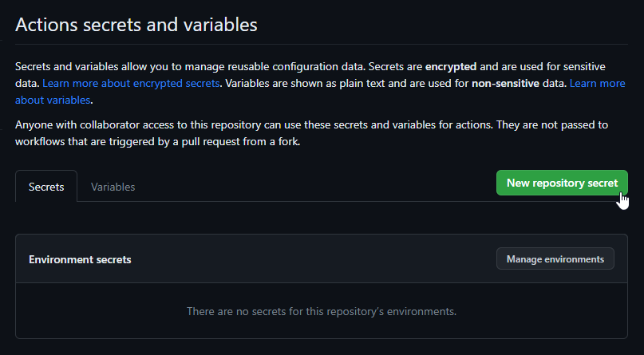

----

The `name` must be `GCP_CREDENTIALS`.

The `secret` will be provided by today's instructor. Copy and paste that json into the text field
and hit "Add secret":

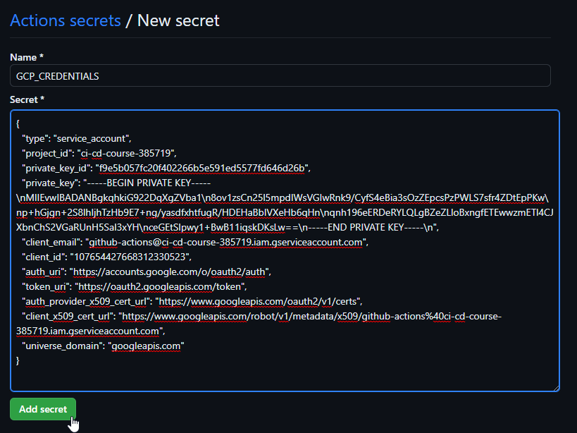

### Enable GitHub Actions Workflow

The definition of the pipeline for this project is included as code in the project itself - GitHub
reads it from the `.github/workflows/` folder. However, it is not enabled by default. To enable it,
click "Actions" in the top project menu:

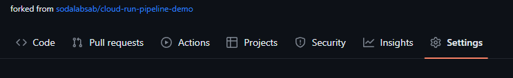

Here, you will also be informed that workflows are disabled by default. Go ahead and enable them,
and we will continue the exercise by looking at the pipeline and its steps in more detail.

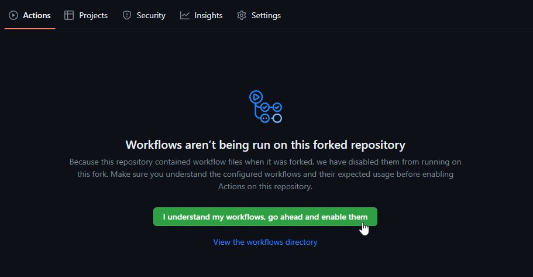

----

Lastly, to verify that everything is set up and configured correctly, let's run the "Initial Cloud
Run Deploy" action:

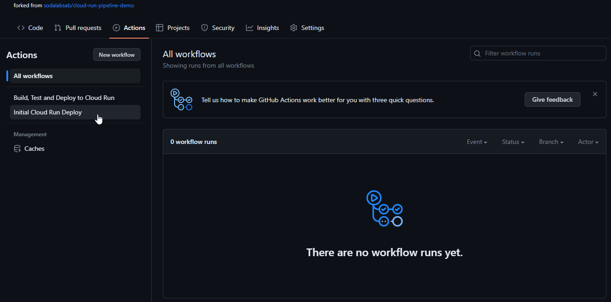

----

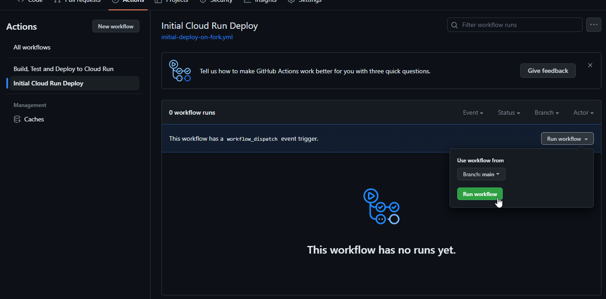

----

Within seconds, the running workflow should appear:

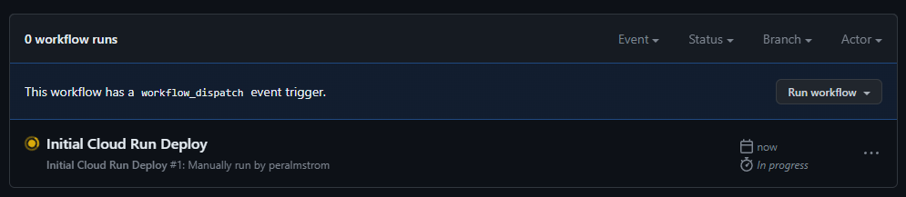

Click it, and you will see the workflow details - including the status of the individual steps:

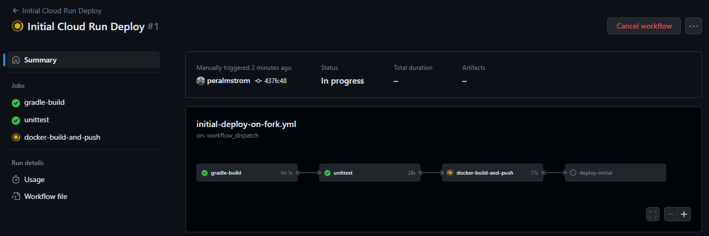

Once all steps are green, we're ready to move on!

This pipeline is meant to demonstrate a "basic" or "typical" setup where the service is built,
unit-tested, containerized, pushed to an artifact registry and then deployed to a staging
environment. End-to-end tests are then run and, if successful, the service is deployed to
production.

The `deploy-production` job has an `output` section which gives you the publicly accessible URL of
the deployed service.

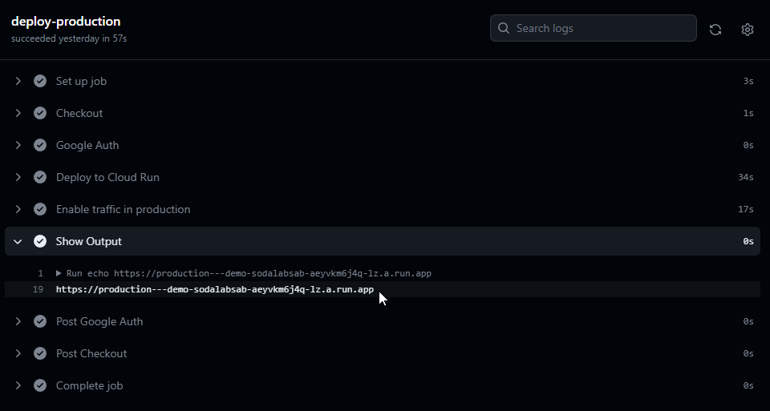

</details>

❗ Create a fork of this repository under your own GitHub account  
❗ Deploy your service to our cloud, find and navigate to the service in your browser, and leave some
feedback for the first exercise

----

<details style="background-color: #303030">
<summary><span style="font-size: 1.8em; font-weight: bold">2️⃣ Second Exercise</span></summary>

### Teamwork

As we have seen, this service is part of a bigger whole. It talks to a "hub" service where you can
use it to leave feedback for the completed exercises. So far, the hub has been out of your control -
but now we're going to start collaborating more and adding functionality to both services in order
to increase the value for the end-users.

In this exercise, we will add some functionality to both services - allowing additional information
to be sent to the hub, and visualized on the hub dashboard.

The hub only accepts a number as feedback for an exercise, a "score" or "grade" if you will. And it
interprets it as "score for the first exercise". Or, the only exercise. But as we have now reached
exercise number two, perhaps you are starting to see the dilemma. We will have to update the API of
the hub to accept (and handle) more information - but we must do it in a controlled and structured
way so that we don't break the service for clients that haven't been updated yet.

</details>

❗ Create a PR for the "exercise 2" branch to main    
❗ Sync rollout with the instructor, making sure the backend hub is upgraded first  
❗ After the hub is upgraded, double-check that your service still works before deploying a new
version
❗ Merge the "exercise 2" PR, wait for it to deploy, and leave some feedback for the second exercise!  
