# cloud-run-pipeline-demo

This purpose of this project is to demonstrate an example CI/CD pipeline using GitHub actions.

<details style="background-color: #303030">
  <summary><span style="font-size: 1.8em; font-weight: bold">0️⃣ About the Application</span></summary>

### Build and Test

The application itself is built with Spring Boot 3, Java 17, and can be compiled, tested and started
locally with the included Gradle wrapper:

  ```
  ./gradlew build test
  java -jar build/libs/demo-0.0.3-SNAPSHOT.jar # or whatever version we're at
  ```

Alternatively, you can build and run it in a container:

  ```
  docker build -t demo .
  docker run --rm -p 8080:8080 demo
  # make sure it's alive
  curl localhost:8080
  ```

Once running, you will find ways to interact with the application at  
http://localhost:8081/api/swagger-ui/index.html

</details>

----

<details style="background-color: #303030">
<summary><span style="font-size: 1.8em; font-weight: bold">1️⃣ First Exercise</span></summary>

### Create a Fork

Start by creating a fork of this repository under your own GitHub account. From there you can
experiment freely - even deploy it to our cloud (if we give you the necessary credentials)!

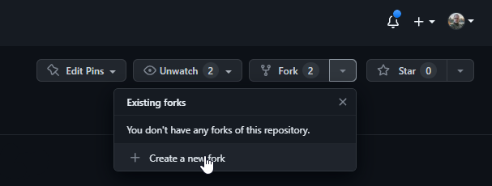

----

Select your own GitHub account as the "Owner", and click the "Create fork" button.

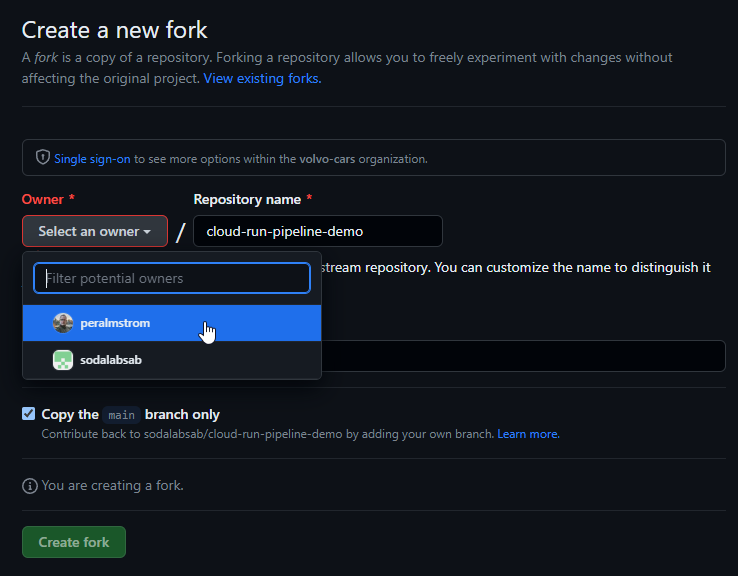

### Add GCP Credentials

In order to push and subsequently deploy the containerized service, we need to add the appropriate
Google Cloud credentials. Start by going into the project settings:

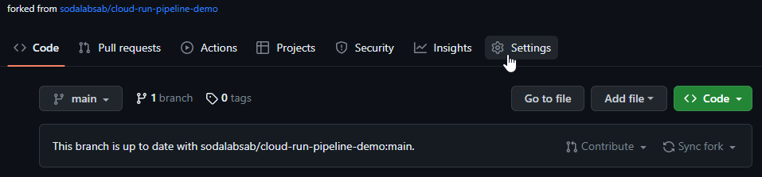

----

In the left-hand menu, under "Security", find "Secrets and variables". Click it, and then "Actions"
below:

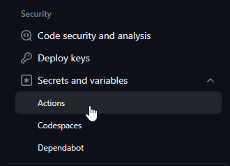

----

Here, add a "New repository secret":

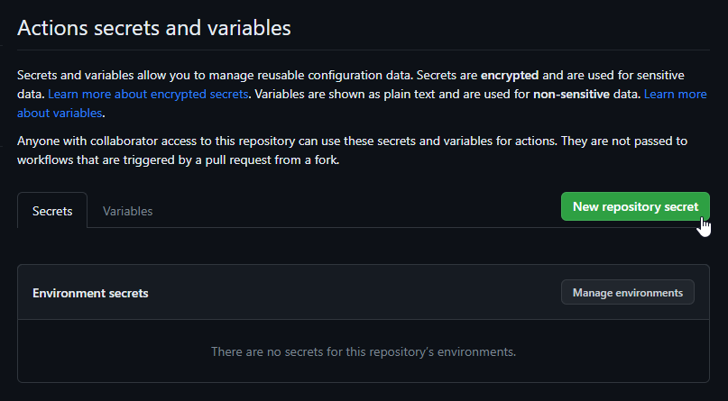

----

The `name` must be `GCP_CREDENTIALS`.

The `secret` will be provided by today's instructor. Copy and paste that json into the text field
and hit "Add secret":

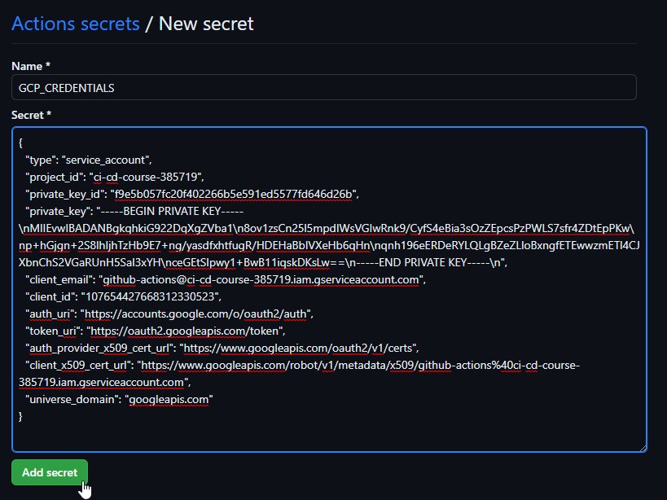

### Enable GitHub Actions Workflow

The definition of the pipeline for this project is included as code in the project itself - GitHub
reads it from the `.github/workflows/` folder. However, it is not enabled by default. To enable it,
click "Actions" in the top project menu:

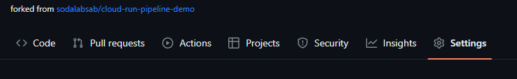

----

Here, you will also be informed that workflows are disabled by default. Go ahead and enable them,
and we will continue the exercise by looking at the pipeline and its steps in more detail.

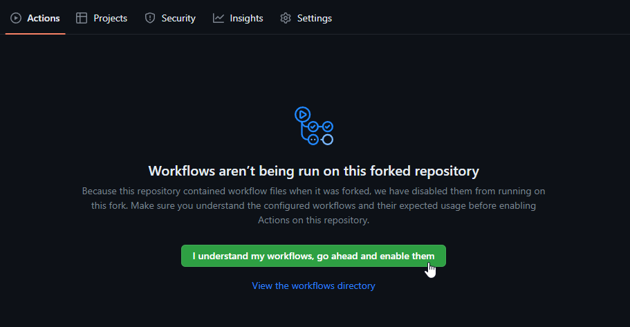

----

Lastly, to verify that everything is set up and configured correctly, let's run the "Initial Cloud
Run Deploy" action:

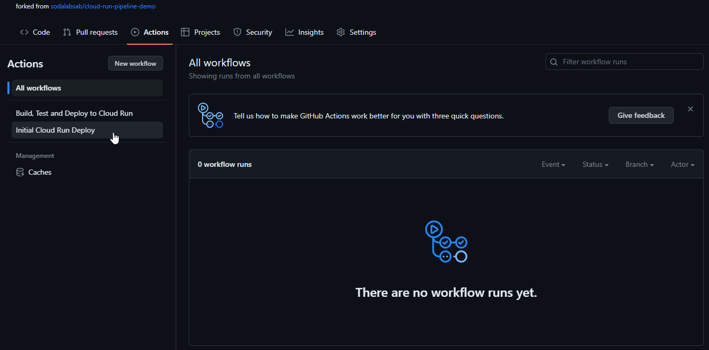

----

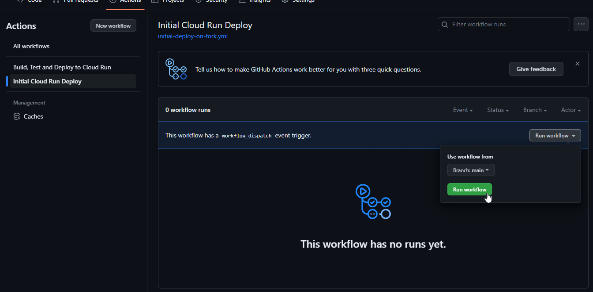

----

Within seconds, the running workflow should appear:

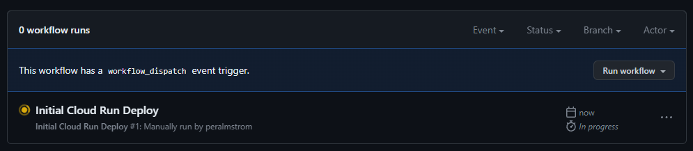

Click it, and you will see the workflow details - including the status of the individual steps:

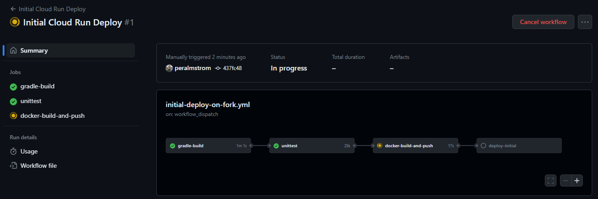

Once all steps are green, we're ready to move on!

This pipeline is meant to demonstrate a "basic" or "typical" setup where the service is built,
unit-tested, containerized, pushed to an artifact registry and then deployed to a staging
environment. End-to-end tests are then run and, if successful, the service is deployed to
production.

The `deploy-staging` and `deploy-production` jobs have an `output` section which gives you the
publicly accessible URL of the deployed service.

</details>

----

<details style="background-color: #303030">
<summary><span style="font-size: 1.8em; font-weight: bold">2️⃣ Second Exercise</span></summary>

### Teamwork

Consider that this "demo" service is but one part of a bigger system. Imagine that it can
communicate with another service, a "central hub", where it can read and write data. Perhaps when
this service starts, it can tell the hub its name so that the hub can keep track of all the
participants' services. Imagine that you are in a team which owns both this service and the hub
service.

You won't have to imagine very hard; the hub service lives here:  
https://ci-cd-course-hub-aeyvkm6j4q-lz.a.run.app/  
and when your service has managed to deploy itself to the cloud, the hub should know that it's alive
and talking.

In addition to the initial registration, you can convince your service to send more messages to the
hub. Visit https://<your-service-url>/api/swagger-ui/index.html for the full documentation.

Your service url can be found in the "deploy-production" step of the pipeline, under "Show output":

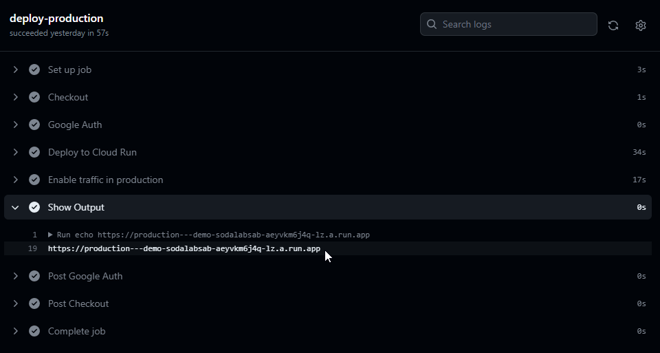

----

In this exercise, we will add some functionality to both services - allowing additional information
to be sent to the hub, and visualized on the hub dashboard.

</details>

----

<details style="background-color: #303030">
<summary><span style="font-size: 1.8em; font-weight: bold">3️⃣  Third Exercise</span></summary>

Imagine now that the hub is outside your control. It still serves the same purpose as before, but it
is owned by another team. You do not know when it will be changed, and you do not know how it might
affect this service.

</details>
